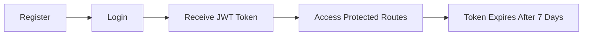

# 📘 Habit Tracker API

<div align="center">

**A fully featured, production-ready RESTful API for tracking daily and weekly habits**

[](https://nodejs.org/)
[](https://expressjs.com/)
[](https://www.postgresql.org/)
[](https://github.com)
[](LICENSE)

</div>

---

## 🌟 Overview

This API allows users to:

- 🔐 Register and authenticate securely
- 📝 Create and manage habits
- 📊 Track daily or weekly progress
- 🔥 View streaks and habit history
- 📈 Analyze personal statistics
- 🎯 Set goals and track completion percentages
- 🔍 Use paginated and filtered habit queries
- 🛡️ Benefit from rate limiting & complete error handling

> **Status:** ✅ Complete & tested (26/26 automated tests passing)

---

## 🛠 Tech Stack

<table>
<tr>
<td>

**Backend**
- Node.js
- Express.js
- JWT Authentication
- bcrypt Hashing

</td>
<td>

**Database**
- PostgreSQL
- pg Driver
- Indexed Queries

</td>
<td>

**Tools**
- dayjs
- Jest & Supertest
- Nodemon

</td>
</tr>
</table>

---

## ✨ Features

### 🔐 Authentication
- User registration & login with email/password
- JWT-based authentication (7-day expiry by default)
- Password hashing using bcrypt
- Token verification middleware for protected routes

### 📝 Habit Management
- Create, read, update, delete habits (CRUD)
- Daily and weekly frequency support
- Optional reminder time for each habit
- Tag-based filtering (e.g., `health`, `fitness`)
- Pagination for habit listing
- Optional `goal` field (target completion count)

### 📅 Habit Tracking
- Mark a habit as completed (one entry per day per habit)
- Undo completion (remove tracking log)
- Retrieve habit history for a configurable number of days
- Streak calculation based on consecutive days completed

### 📊 User Statistics
- Total habits created
- Total unique days tracked
- Longest streak across all habits
- Breakdown of habits by frequency (daily/weekly)

### 🚀 Bonus Features
- ⚡ Rate limiting (100 requests/hour per user/IP)
- 📈 Completion percentage vs goal
- 🧪 Comprehensive Jest + Supertest coverage
- 🏗️ Clean MVC architecture

---

## 📁 Project Structure

```
src/
├── __tests__/
│   └── api.test.js              # 26 test cases (all passing)
├── config/
│   └── database.js              # PostgreSQL connection pool
├── controllers/
│   ├── authController.js        # Authentication logic
│   ├── habitController.js       # Habit management + goals + progress
│   ├── trackingController.js    # Habit tracking logic
│   └── userStatsController.js   # User statistics logic
├── middleware/
│   ├── verifyToken.js           # JWT verification
│   └── rateLimiter.js           # Rate limiting
├── routes/
│   ├── authRoutes.js            # /auth endpoints
│   ├── habitRoutes.js           # /habits and tracking endpoints
│   └── userRoutes.js            # /users/stats endpoint
├── services/
│   ├── userService.js           # User-related business logic
│   ├── habitService.js          # Habit-related business logic
│   ├── trackingService.js       # Tracking-related business logic
│   └── userStatsService.js      # Stats-related business logic
└── app.js                       # Express app entry point
```

---

## 🚀 Getting Started

### Prerequisites

- **Node.js** v14 or higher
- **PostgreSQL** (local or cloud)
- npm or yarn

### Installation

1. **Clone or navigate to the project**
   ```bash
   cd "d:\Personal Habit Tracking Backend"
   ```

2. **Install dependencies**
   ```bash
   npm install
   ```

3. **Configure environment variables**
   
   Create a `.env` file in the project root:
   
   ```env
   NODE_ENV=production
   PORT=5000
   
   # PostgreSQL (from Supabase Project Settings)
   DB_HOST=your-project.supabase.co
   DB_PORT=5432
   DB_NAME=postgres
   DB_USER=postgres
   DB_PASSWORD=your_supabase_password
   PGSSLMODE=require
   
   # JWT
   JWT_SECRET=your_super_secret_jwt_key_change_in_production
   JWT_EXPIRY=7d
   
   # Bcrypt
   BCRYPT_ROUNDS=10
   ```

4. **Database setup**
   
   The database is already hosted and configured at Supabase. For local development, see [Database Setup](#database-setup-optional) below.

### Running the Application

**Development mode** (with auto-reload)
```bash
npm run dev
```

**Production mode**
```bash
npm start
```

The server will run at: `http://localhost:5000`

**Verify installation:**
```bash
curl http://localhost:5000/health
```

---

## 📖 API Documentation

### Base URL
```
http://localhost:5000
```

### Authentication

#### Register a new user
```http
POST /auth/register
Content-Type: application/json

{
  "name": "John Doe",
  "email": "john@example.com",
  "password": "securePassword123"
}
```

**Response:** `201 Created`
```json
{
  "success": true,
  "message": "User registered successfully",
  "user": {
    "id": 1,
    "name": "John Doe",
    "email": "john@example.com"
  }
}
```

#### Login
```http
POST /auth/login
Content-Type: application/json

{
  "email": "john@example.com",
  "password": "securePassword123"
}
```

**Response:** `200 OK`
```json
{
  "success": true,
  "message": "Login successful",
  "token": "<jwt_token>",
  "user": {
    "id": 1,
    "name": "John Doe",
    "email": "john@example.com"
  }
}
```

> **Note:** Use the token for all protected routes:
> ```http
> Authorization: Bearer <jwt_token>
> ```

---

### 📝 Habit Management (Protected)

#### Create a habit
```http
POST /habits
Authorization: Bearer <token>
Content-Type: application/json

{
  "title": "Morning Meditation",
  "description": "10 minutes of meditation every morning",
  "frequency": "daily",
  "tags": "mindfulness,health",
  "reminder_time": "07:00:00",
  "goal": 30
}
```

#### Get habits (with pagination & filters)
```http
GET /habits?page=1&limit=10&tag=health
Authorization: Bearer <token>
```

#### Get single habit
```http
GET /habits/:id
Authorization: Bearer <token>
```

Returns habit details including `streak` and `completionPercentage`.

#### Update habit
```http
PUT /habits/:id
Authorization: Bearer <token>
Content-Type: application/json

{
  "title": "Evening Meditation",
  "frequency": "daily",
  "reminder_time": "19:00:00",
  "goal": 40
}
```

#### Delete habit
```http
DELETE /habits/:id
Authorization: Bearer <token>
```

---

### 📅 Habit Tracking (Protected)

#### Track habit for today
```http
POST /habits/:id/track
Authorization: Bearer <token>
```

> **Note:** Only one tracking entry per habit per day (enforced by UNIQUE constraint)

#### Get habit history
```http
GET /habits/:id/history?days=30
Authorization: Bearer <token>
```

Returns history, `streak`, and number of days considered (default: 7 days).

#### Remove tracking (undo)
```http
DELETE /habits/:id/track
Authorization: Bearer <token>
Content-Type: application/json

{
  "date": "2025-11-28"
}
```

---

### 📊 User Statistics (Protected)

```http
GET /users/stats
Authorization: Bearer <token>
```

**Response:**
```json
{
  "success": true,
  "stats": {
    "totalHabits": 5,
    "totalDaysTracked": 42,
    "longestStreak": 12,
    "habitsByFrequency": {
      "daily": 3,
      "weekly": 2
    }
  }
}
```

---

### 🎯 Goals & Progress

#### Get habit progress
```http
GET /habits/:id/progress
Authorization: Bearer <token>
```

**Response:**
```json
{
  "success": true,
  "progress": {
    "habitId": 1,
    "title": "Exercise",
    "frequency": "weekly",
    "goal": 5,
    "weeklyCompleted": 3,
    "monthlyCompleted": 12,
    "currentStreak": 4,
    "totalCompleted": 28,
    "completionPercentage": 560
  }
}
```

> `completionPercentage = (totalCompleted / goal) × 100` (can exceed 100%)

---

## 🗄️ Database Setup (Optional)

> **Note:** The database is already hosted at Supabase. Use this section only for local development.

### Users table
```sql
CREATE TABLE IF NOT EXISTS users (
  id SERIAL PRIMARY KEY,
  name VARCHAR(255) NOT NULL,
  email VARCHAR(255) UNIQUE NOT NULL,
  password VARCHAR(255) NOT NULL,
  created_at TIMESTAMP DEFAULT CURRENT_TIMESTAMP,
  updated_at TIMESTAMP DEFAULT CURRENT_TIMESTAMP
);

CREATE INDEX IF NOT EXISTS idx_users_email ON users(email);
```

### Habits table
```sql
CREATE TABLE IF NOT EXISTS habits (
  id SERIAL PRIMARY KEY,
  user_id INTEGER NOT NULL REFERENCES users(id) ON DELETE CASCADE,
  title VARCHAR(255) NOT NULL,
  description TEXT,
  frequency VARCHAR(50) NOT NULL CHECK (frequency IN ('daily', 'weekly')),
  tags VARCHAR(255),
  reminder_time TIME,
  goal INTEGER,
  created_at TIMESTAMP DEFAULT CURRENT_TIMESTAMP,
  updated_at TIMESTAMP DEFAULT CURRENT_TIMESTAMP
);

CREATE INDEX IF NOT EXISTS idx_habits_user_id ON habits(user_id);
CREATE INDEX IF NOT EXISTS idx_habits_created_at ON habits(created_at);
```

### Tracking logs table
```sql
CREATE TABLE IF NOT EXISTS tracking_logs (
  id SERIAL PRIMARY KEY,
  habit_id INTEGER NOT NULL REFERENCES habits(id) ON DELETE CASCADE,
  user_id INTEGER NOT NULL REFERENCES users(id) ON DELETE CASCADE,
  completed_date DATE NOT NULL,
  completed_at TIMESTAMP DEFAULT CURRENT_TIMESTAMP,
  UNIQUE(habit_id, completed_date)
);

CREATE INDEX IF NOT EXISTS idx_tracking_logs_habit_id ON tracking_logs(habit_id);
CREATE INDEX IF NOT EXISTS idx_tracking_logs_user_id ON tracking_logs(user_id);
CREATE INDEX IF NOT EXISTS idx_tracking_logs_completed_date ON tracking_logs(completed_date);
```

### Goal column migration
```sql
ALTER TABLE habits 
ADD COLUMN IF NOT EXISTS goal INTEGER DEFAULT NULL;
```

---

## 🧪 Testing

Run the test suite:
```bash
npm test
```

**Current status:**
```
Test Suites: 1 passed, 1 total
Tests:       26 passed, 26 total
```

**Test coverage includes:**
- ✅ Health check
- ✅ Registration & login
- ✅ Habit CRUD operations
- ✅ Pagination & tag filtering
- ✅ Tracking & history
- ✅ User statistics
- ✅ Rate limiting
- ✅ Error responses

---

## 🔒 Security Considerations

- 🔐 Passwords hashed with bcrypt (configurable rounds)
- 🎫 JWT tokens signed with secret key and expiry time
- 🚫 No password fields returned in any API response
- 💉 Parameterized queries to prevent SQL injection
- 🔑 Environment variables for secrets and configuration

---

## 🛡️ Error Handling

Standard HTTP status codes:

| Code | Meaning |
|------|---------|
| `200` | OK - successful request |
| `201` | Created - resource created |
| `400` | Bad Request - invalid or missing data |
| `401` | Unauthorized - missing/invalid token |
| `404` | Not Found - resource not found |
| `409` | Conflict - duplicates or constraint violation |
| `429` | Too Many Requests - rate limit exceeded |
| `500` | Internal Server Error - unexpected errors |

**Example error response:**
```json
{
  "error": "Email already exists"
}
```

---

## 🎁 Bonus Features

### 1. Rate Limiting
- **Limit:** 100 requests/hour per user/IP
- **Response headers:**
  - `X-RateLimit-Limit`
  - `X-RateLimit-Remaining`
  - `X-RateLimit-Reset`
- Exceeding the limit returns `429 Too Many Requests`

### 2. Completion Percentage
- Included in `GET /habits/:id` when a `goal` is set
- May exceed 100% if user surpasses the target

### 3. Clean Architecture
- Separation of concerns (controllers, services, routes, middleware)
- Easy to extend with new endpoints and logic

---

## ✅ Completion Checklist

- ✅ User authentication (register/login)
- ✅ JWT generation & verification
- ✅ Full habit CRUD
- ✅ Daily tracking with one-per-day constraint
- ✅ Streak calculation
- ✅ History retrieval
- ✅ Pagination & tag filtering
- ✅ Reminder time storage
- ✅ Goals & progress tracking
- ✅ Completion percentage
- ✅ Rate limiting
- ✅ User statistics endpoint
- ✅ Clean MVC structure
- ✅ Comprehensive tests (26/26)

---

## 🔄 Authentication Flow



1. **Register** via `POST /auth/register`
2. **Login** via `POST /auth/login`
3. Receive a **JWT token**
4. Send `Authorization: Bearer <token>` header for all protected endpoints
5. Tokens expire after the duration defined in `JWT_EXPIRY` (default 7 days)

---

## 📞 How to Use This API

1. The backend and database are already hosted
2. You will receive:
   - Base API URL: `http://localhost:5000`
   - A test user account (email/password) or instructions to register via `/auth/register`
3. Use tools like **Postman** or **Thunder Client** to:
   - Register or log in
   - Copy the JWT token from `/auth/login`
   - Send requests with `Authorization: Bearer <token>` header to the protected routes

---

<div align="center">

**Built with ❤️ using Node.js, Express, and PostgreSQL**

[Report Bug](https://github.com) · [Request Feature](https://github.com)

</div>

---

## 📥 Download

To save this README:
1. Click the copy icon in the artifact toolbar above
2. Paste into a new file named `README.md`
3. Save in your project root directory